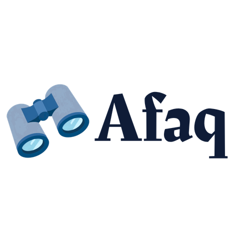
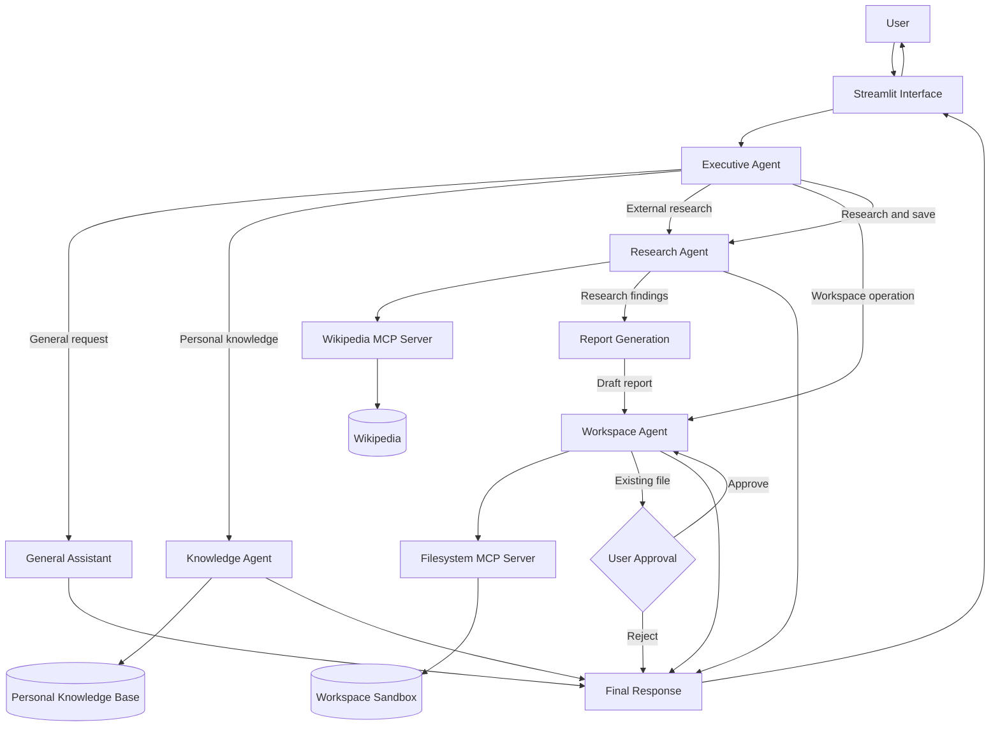
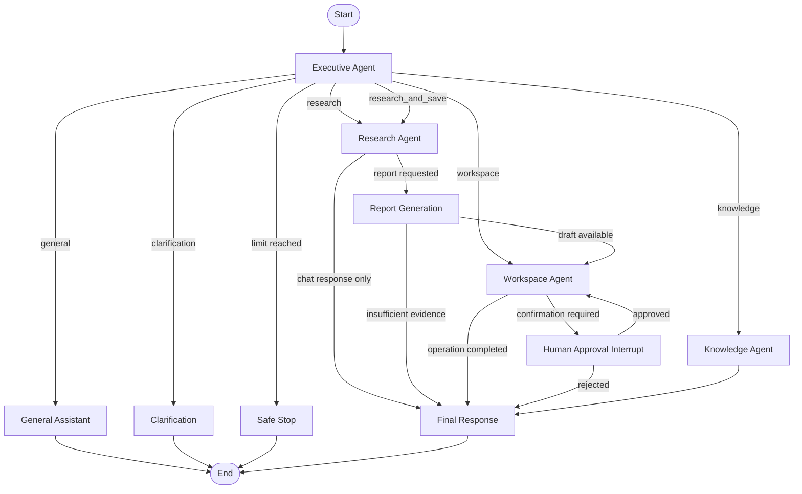
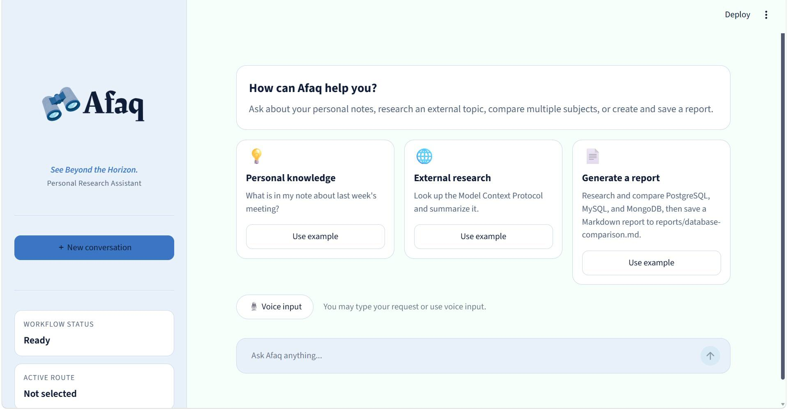
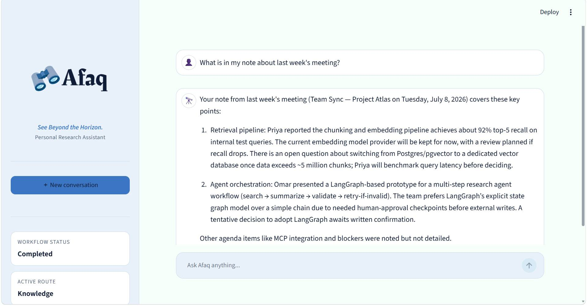
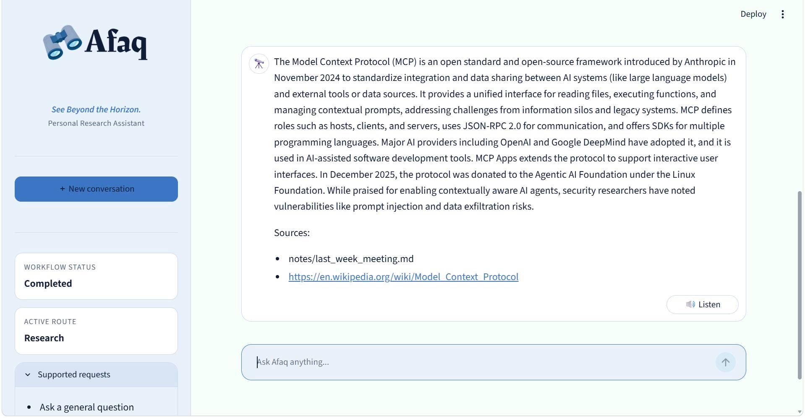
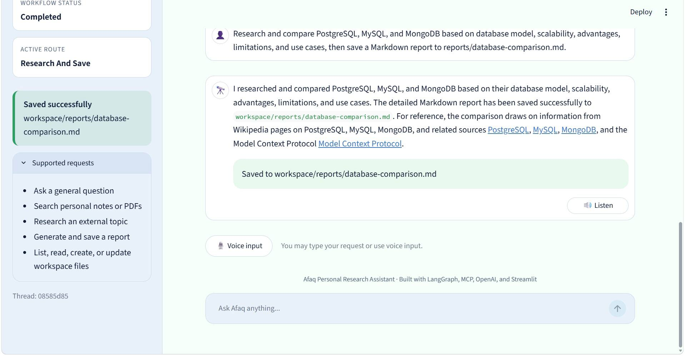
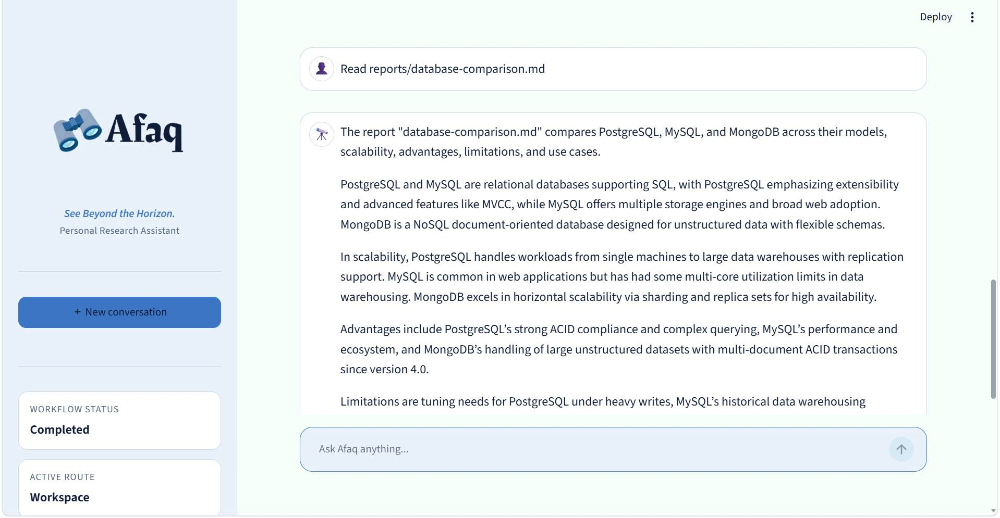
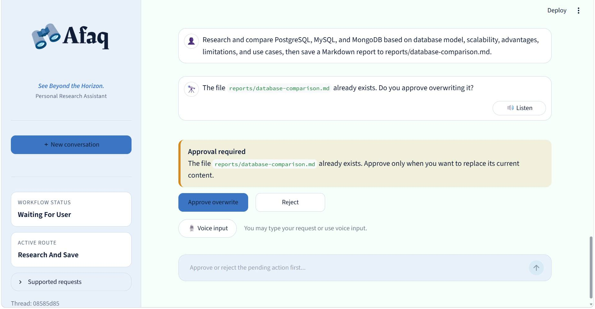

<div align="center">



# Afaq | آفاق

### *See Beyond the Horizon.*

A multi-agent Personal Research Assistant built with **LangGraph**, **OpenAI**, **Model Context Protocol (MCP)**, and **Streamlit**.

[](https://www.python.org/)
[](https://www.langchain.com/langgraph)
[](https://openai.com/)
[](https://streamlit.io/)
[](https://modelcontextprotocol.io/)

</div>

---
## Overview

**Afaq** is a multi-agent AI system designed to assist a single knowledge worker through one conversational interface.

The system can answer general questions, search the user's personal notes and documents, conduct external research, generate structured reports, and manage files inside a protected workspace.

Unlike a standard chatbot, Afaq uses an orchestrated team of specialized agents. An Executive Agent analyzes each request, creates an execution plan, selects the required capabilities, and coordinates their outputs into one grounded response.

Afaq was initially designed as a complete multi-agent architecture during Week 2 of the Masar Applied AI Engineering program and implemented as a working capstone project in Week 3.

---
## Key Features

- **Multi-agent orchestration** using LangGraph
- **Executive Agent** for request classification, planning, and routing
- **General Assistant** for conversation and simple questions
- **Knowledge Agent** for grounded personal-document retrieval
- **Research Agent** for external Wikipedia research with sources
- **Report Generation capability** for structured Markdown and text reports
- **Workspace Agent** for safe file creation, reading, updating, and listing
- **Wikipedia MCP server** for external research
- **Filesystem MCP server** for sandboxed workspace operations
- **Human approval** before overwriting an existing file
- **Checkpointed workflows** with separate conversation thread IDs
- **Grounded citations** for personal and external knowledge
- **Speech-to-Text** voice input
- **Text-to-Speech** response playback
- **Streamlit chat interface**
- **Configurable stop conditions and error limits**

---
## Required End-to-End Workflows

Afaq supports the three main project scenarios:

### 1. Personal Knowledge Retrieval

```text
What is in my note about last week's meeting?
```

The system:

1. Classifies the request as personal knowledge retrieval.
2. Searches the user's knowledge base.
3. Retrieves the most relevant note or document section.
4. Produces an answer grounded only in the retrieved evidence.
5. Includes the personal document path as a citation.

### 2. External Research

```text
Look up the Model Context Protocol and summarize it for me.
```

The system:

1. Classifies the request as external research.
2. Searches Wikipedia through the Research MCP server.
3. Fetches relevant articles.
4. Extracts grounded facts.
5. Returns a summary with source links.

### 3. Research, Report Generation, and File Saving

```text
Research and compare PostgreSQL, MySQL, and MongoDB,
then save a Markdown report to reports/database-comparison.md.
```

The system:

1. Creates a comparison research plan.
2. Searches each named topic separately.
3. Synthesizes the sourced findings.
4. Generates a structured Markdown report.
5. Writes the report through the Filesystem MCP server.
6. Confirms the exact saved path.
7. Requests user approval if the file already exists.

---
## System Architecture

Afaq uses a **supervisor-based multi-agent topology**.

The Executive Agent acts as the central orchestrator. It receives the user's request, determines the required specialist capabilities, controls execution order, and returns one final response.



---
## LangGraph Workflow

The workflow uses conditional routing after each node.



---
## Agent Roster

| Component | Responsibility |
|---|---|
| **Executive Agent** | Classifies requests, builds an execution plan, selects routes, extracts file paths, and coordinates the workflow. |
| **General Assistant** | Handles conversation, explanations, and simple requests that do not require specialist tools. |
| **Knowledge Agent** | Searches the user's notes, documents, and PDFs and returns evidence-grounded answers with personal citations. |
| **Research Agent** | Plans external research, searches Wikipedia, reads articles, and extracts sourced facts. |
| **Report Generation** | Converts grounded research findings into a clean Markdown or text report. |
| **Workspace Agent** | Performs safe create, read, update, and list operations within the workspace sandbox. |
| **Final Response** | Combines verified workflow results into one concise user-facing response. |

### Design Decision: Report Generation as a Capability

The Week 2 design allowed the Report Writer to be either a separate agent or a capability owned by another component.

In the implementation, report generation is a dedicated node and capability rather than a fully autonomous agent. It does not perform research or file operations. It only converts verified research evidence into a structured document.

This keeps responsibilities clear while avoiding unnecessary agent complexity.

---
## Orchestration Strategy

Afaq uses a hybrid orchestration strategy:

- The **Executive Agent uses an LLM with structured output** to classify the request and create a plan.
- Deterministic Python rules validate and normalize the routing decision.
- LangGraph conditional edges enforce the allowed execution paths.
- Dependent tasks run sequentially.
- Independent knowledge and research retrieval can be designed to run concurrently when both are required.
- File operations remain deterministic and are never selected directly by a language model without validation.

### Sequential Operations

The following operations must remain sequential:

```text
Research
→ Report Generation
→ Workspace Save
→ Final Response
```

A report cannot be generated before research evidence exists, and a file cannot be saved before its content is ready.

### Parallel Operations

For combined personal and external research requests, Knowledge and Research retrieval may run independently before their results are merged into the shared state.

---
## Shared State

All workflow components communicate through a shared typed `ResearchAssistantState`, which stores the information required for routing and coordination.

| Field | Purpose |
|---|---|
| `messages` | Conversation history |
| `intent` | Classified request type |
| `plan` | Execution plan |
| `knowledge_findings` | Retrieved personal knowledge |
| `research_findings` | Retrieved external research |
| `citations` | Source references |
| `draft_report` | Generated report |
| `file_path` | Workspace file path |
| `workflow_status` | Current workflow status |
| `final_response` | Final response returned to the user |

Collection fields (e.g., messages, findings, and citations) use append-style reducers, while single-value fields (e.g., intent, file path, and status) are replaced as the workflow progresses.

---
## Communication Patterns

Afaq uses a shared typed LangGraph state instead of unrestricted free-text communication between agents. This improves validation, reliability, and workflow coordination.

The system uses four communication patterns:

| Pattern | Purpose |
|---|---|
| **Request/Response** | The Executive Agent invokes specialist agents and receives their results. |
| **Handoff** | Research findings are passed to Report Generation. |
| **Blackboard** | Agents communicate through the shared workflow state. |
| **Human-in-the-Loop** | The workflow pauses for user approval before overwriting files. |

---
## Tools and MCP Servers

Afaq uses MCP for capabilities that benefit from clear tool boundaries and reusable external interfaces.

### Wikipedia MCP Server

Client: **Research Agent**

| Tool | Description | Risk |
|---|---|---|
| `search_wikipedia` | Searches Wikipedia for relevant articles. | `network` |
| `fetch_wikipedia_article` | Retrieves the content and metadata of a selected article. | `network` |

The Research Agent does not directly browse arbitrary sources. It communicates with the Wikipedia MCP server through an MCP client session.

### Filesystem MCP Server

Client: **Workspace Agent**

| Tool | Description | Risk |
|---|---|---|
| `list_files` | Lists files and folders inside the workspace. | `read` |
| `read_file` | Reads a supported text file from the workspace. | `read` |
| `create_file` | Creates a file inside the workspace. | `write` |
| `update_file` | Updates an existing file after approval. | `write` |

The filesystem server validates every path and prevents access outside the approved workspace.

### Local Knowledge Tools

Client: **Knowledge Agent**

| Tool | Description | Risk |
|---|---|---|
| `search_knowledge` | Searches personal notes, text files, Markdown files, and parsed PDFs. | `read` |
| `read_knowledge_item` | Safely reads a selected knowledge-base item. | `read` |

### Speech Tools

Client: **Streamlit interface**

| Tool | Description | Risk |
|---|---|---|
| `transcribe_audio` | Converts a recorded user message into text. | `network` |
| `synthesize_speech` | Converts an assistant response into playable audio. | `network` |

Speech is implemented as an input/output layer rather than a separate autonomous agent.

---
## Safety and Guardrails

Afaq includes multiple safety controls.

### Workspace Sandbox

All file paths are resolved relative to:

```text
workspace/
```

Absolute paths and path traversal attempts are rejected.

Examples of rejected paths:

```text
C:/Users/example/private.txt
../../private.txt
/workspace-outside/report.md
```

### Overwrite Confirmation

Afaq does not overwrite an existing file automatically.

When a target file already exists:

1. The Workspace Agent returns `confirmation_required`.
2. LangGraph pauses using an interrupt.
3. The Streamlit interface displays **Approve overwrite** and **Reject** actions.
4. The workflow resumes only after the user responds.

### Grounded Responses

The Knowledge and Research Agents are instructed to:

- Use only retrieved evidence
- Preserve exact source references
- Avoid unsupported claims
- Return a not-found result when evidence is insufficient
- Prevent model-generated citations from replacing verified source metadata

### Report Safety

The Report Generator:

- Uses only existing research findings
- Does not conduct new research
- Does not write files
- Cannot invent the final source list
- Refuses report generation when evidence is insufficient

### Stop Conditions

The workflow stops safely when:

- The requested goal is complete
- The maximum step count is reached
- The error budget is exceeded
- A clarification is required
- Human approval is required
- An unrecoverable error occurs

Default limits:

```text
Maximum workflow steps: 10
Maximum errors: 3
```

---
## Prompting Strategy

Each component uses prompts specialized for its role:

- Executive: routing and planning
- Knowledge: grounded retrieval
- Research: evidence-based summarization
- Report Generation: structured writing
- Workspace: deterministic execution
- Final Response: response synthesis

---
## Checkpointing and Conversation Isolation

The LangGraph workflow is compiled with an in-memory checkpointer.

Every Streamlit conversation receives a unique thread ID:

```text
afaq-<uuid>
```

This provides:

- Separate state for each conversation
- Workflow resumption after human approval
- Safe continuation after a LangGraph interrupt
- Isolation between user sessions

The current implementation uses `MemorySaver`, which is suitable for the working capstone version.

For production deployment, the checkpointer could be replaced with SQLite, PostgreSQL, or another persistent store.

---
## Voice Interaction (Bonus)

Afaq supports the optional speech bonus by adding a voice interface on top of the existing multi-agent workflow. Voice does not introduce new agents or alter the orchestration process—it simply provides an alternative way for users to interact with the assistant.

### Speech-to-Text (STT)

Users can submit requests using their microphone.

Workflow:

```text
Microphone
→ OpenAI Speech-to-Text
→ Executive Agent
→ LangGraph Workflow
```

The transcribed request follows the same routing and execution process as a typed request.

### Text-to-Speech (TTS)

Every assistant response can be played aloud using the **Listen** button.

Workflow:

```text
Assistant Response
→ OpenAI Text-to-Speech
→ Audio Playback
```

This allows Afaq to function as a conversational voice assistant while preserving the same grounded responses, citations, and safety mechanisms.

### Voice Demonstration

A short demonstration of the voice functionality is available below.

🎥 **Voice Demo**

[Watch the demo](assets/videos/voice_demo.mp4)

---
## Interface Preview

### Home Interface



### Personal Knowledge Retrieval



### External Research



### Report Generation



### Workspace Operation



### Human Approval



---
## Project Structure

afaq-personal-research-assistant/
├── agents/
├── assets/
├── knowledge_base/
├── mcp_servers/
├── prompts/
├── tools/
├── workspace/
├── app.py
├── graph.py
├── README.md
├── requirements.txt
└── Week2_Design_Document.pdf

---
## Installation

### 1. Clone the repository

```bash
git clone https://github.com/NouraAbuthnain/afaq-personal-research-assistant.git
cd afaq-personal-research-assistant
```

### 2. Create a virtual environment

#### Windows PowerShell

```powershell
python -m venv .venv
.\.venv\Scripts\Activate.ps1
```

If PowerShell blocks activation:

```powershell
Set-ExecutionPolicy -Scope Process -ExecutionPolicy Bypass
.\.venv\Scripts\Activate.ps1
```

#### macOS or Linux

```bash
python3 -m venv .venv
source .venv/bin/activate
```

### 3. Install dependencies

```bash
python -m pip install --upgrade pip
python -m pip install -r requirements.txt
```

---
## Environment Configuration

Copy the example environment file:

### Windows PowerShell

```powershell
Copy-Item .env.example .env
```

### macOS or Linux

```bash
cp .env.example .env
```

Add your OpenAI API key:

```env
# OpenAI API key
OPENAI_API_KEY=your_openai_api_key_here

# Main LLM used by the agents
OPENAI_MODEL=gpt-4.1-mini

# Speech-to-text model
OPENAI_STT_MODEL=gpt-4o-mini-transcribe

# Text-to-speech model
OPENAI_TTS_MODEL=gpt-4o-mini-tts

# Voice used for text-to-speech
OPENAI_TTS_VOICE=coral
```

---
## Running the Application

Start the Streamlit interface:

```bash
streamlit run app.py
```

The application should open automatically in your browser.

Default local address:

```text
http://localhost:8501
```

---
## Example Requests

### General Assistance

```text
Explain the difference between an AI agent and a chatbot.
```

### Personal Knowledge Retrieval

```text
What is in my note about last week's meeting?
```

### External Research

```text
Look up the Model Context Protocol and summarize it.
```

### Research and Report Generation

```text
Research and compare PostgreSQL, MySQL, and MongoDB based on
database model, scalability, use cases, advantages, and limitations,
then save the report to reports/database-comparison.md.
```

### Workspace Operations

```text
Read reports/database-comparison.md.
```

```text
List all files in my reports folder.
```

---
## Development Tests

Run any manual test from the `dev/` directory, for example:

```bash
python -m dev.test_graph
```

---
## Technologies

- Python
- LangGraph
- LangChain
- OpenAI API
- Streamlit
- MCP
- Pydantic
- PyPDF

---
## Requirements Coverage

| Project Requirement | Implementation |
|---|---|
| Orchestration | Executive Agent with LangGraph routing |
| Personal knowledge retrieval | Knowledge Agent with grounded citations |
| External research | Research Agent using the Wikipedia MCP server |
| Report generation | Report Generator with Markdown output |
| Workspace operations | Filesystem MCP (create, read, update, list) |
| Safe file handling | Sandboxed workspace with overwrite confirmation |
| Shared state | `ResearchAssistantState` |
| Workflow management | Stop conditions, thread isolation, and human approval |
| User interface | Streamlit chat application |
| MCP integration | Wikipedia and Filesystem MCP servers |
| Voice bonus | Speech-to-Text (STT) and Text-to-Speech (TTS) |
| Documentation | README, setup instructions, and Week 2 design document |

---
## Changes from the Week 2 Design

The implementation follows the Week 2 design with a few practical refinements:

1. **Report Writer**
   - Designed as either an agent or capability.
   - Implemented as a dedicated report-generation node without independent tool access.
   - This reduces unnecessary autonomy and prevents it from conducting unsupported research.

2. **General Assistant and Final Response**
   - Implemented in the same module because both are user-facing language-generation capabilities.
   - They remain separate LangGraph nodes with different responsibilities.

3. **Workspace Agent**
   - Implemented deterministically rather than with an additional LLM call.
   - This is safer, less expensive, and easier to validate.

4. **Checkpoint Persistence**
   - Week 2 proposed persistent checkpoint storage for production.
   - The capstone uses LangGraph `MemorySaver` to support working session-level resume and human approval.
   - A database-backed checkpointer can be added later.

5. **Voice**
   - Added as an optional interface layer.
   - It does not alter the core agent architecture.

---
## Limitations

- External research depends on the coverage of available Wikipedia articles.
- Knowledge retrieval uses local document search rather than a vector database.
- Checkpoints are stored in memory and are not persisted across sessions.
- The application is designed for a single user and does not include authentication.
- Voice features require access to the configured OpenAI audio models.

---

## Future Improvements

- Add semantic retrieval with embeddings and a vector database.
- Support broader web-search MCP servers.
- Persist workflow checkpoints using PostgreSQL or SQLite.
- Add user authentication and document upload.
- Support additional report formats (e.g., DOCX).
- Improve observability, evaluation, and deployment.

---
## Author

**Noura Abuthnain**

Masar by Sani – Agentic AI Track
July 2026

---

<div align="center">

### Afaq | آفاق

*See Beyond the Horizon.*

</div>